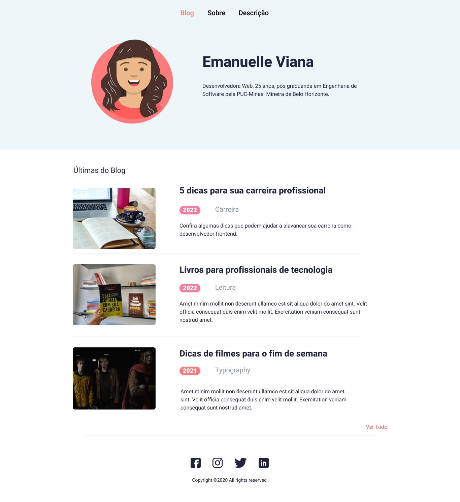
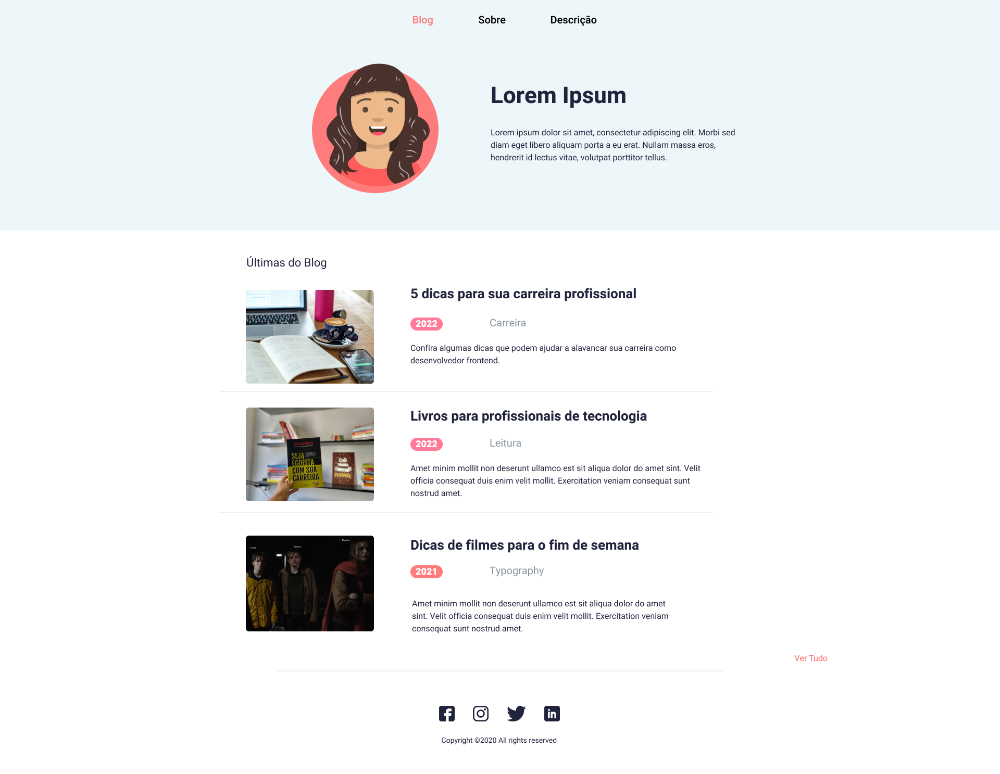
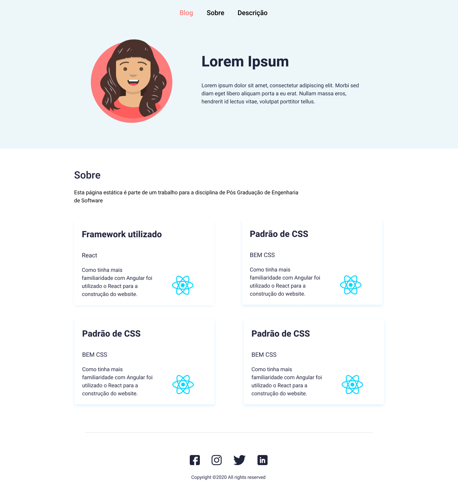

# Apresentação
Este repositório faz parte de um trabalho para a disciplina de Arquitetura de Frontend, do curso de Pós Graduação
em Engenharia de Software.

------------------------------------
 ## 🌼  Tecnologias utilizadas ##
* React
* Material UI
* Typescript
* OOCSS

## Requisitos
Desenvolva uma aplicação, fazendo as seguintes escolhas:

a) Escolha algum framework de componentes de sua preferência (React, Vue ou Angular);

b) Após o desenvolvimento da tela, aponte quais as dificuldades encontradas no desenvolvimento com base nas escolhas que você fez.
## Resultados ##
### a) Web ###

 

### b) Dificuldades encontradas ###
As principais dificuldades encontradas foram:
- Falta de estrutura definida: Como vindo de um contexto com Angular, a falta de uma estrutura definida de pastas, código etc foi um obstáculo;
- Forma de escrever código: Escrever HTML junto com Javascript foi uma forma diferente do habitual;
- Estados: Ainda não consegui entender o Redux;
- Rotas: Trabalhar com as rotas foi mais difícil. Vez outra era gerado algum erro de contexto ao usar as funções. A navegação pelo menu ainda não funcionou com a lib de rotas, até então está sendo feita com o window.location, necessitando refresh desnecessário da página;
- Necessidade de instalar pacotes para tudo: No Angular o projeto já é criado com praticamente tudo o que se precisa, no React tive que instalar pacotes até para trabalhar com rotas;
- Padrão de CSS: Escrever CSS com um padrão é vantajoso, mas achei difícil 
adquirir o costume de escrever tudo no padrão;
- Responsividade: É sempre custoso tratar responsividade. O Material auxiliou em alguns pontos mas ainda não foi possível deixar responsivo.

# Getting Started with Create React App

This project was bootstrapped with [Create React App](https://github.com/facebook/create-react-app).

## Available Scripts

In the project directory, you can run:

### `npm start`

Runs the app in the development mode.\
Open [http://localhost:3000](http://localhost:3000) to view it in the browser.

The page will reload if you make edits.\
You will also see any lint errors in the console.

### `npm test`

Launches the test runner in the interactive watch mode.\
See the section about [running tests](https://facebook.github.io/create-react-app/docs/running-tests) for more information.

### `npm run build`

Builds the app for production to the `build` folder.\
It correctly bundles React in production mode and optimizes the build for the best performance.

The build is minified and the filenames include the hashes.\
Your app is ready to be deployed!

See the section about [deployment](https://facebook.github.io/create-react-app/docs/deployment) for more information.

### `npm run eject`

**Note: this is a one-way operation. Once you `eject`, you can’t go back!**

If you aren’t satisfied with the build tool and configuration choices, you can `eject` at any time. This command will remove the single build dependency from your project.

Instead, it will copy all the configuration files and the transitive dependencies (webpack, Babel, ESLint, etc) right into your project so you have full control over them. All of the commands except `eject` will still work, but they will point to the copied scripts so you can tweak them. At this point you’re on your own.

You don’t have to ever use `eject`. The curated feature set is suitable for small and middle deployments, and you shouldn’t feel obligated to use this feature. However we understand that this tool wouldn’t be useful if you couldn’t customize it when you are ready for it.

## Learn More

You can learn more in the [Create React App documentation](https://facebook.github.io/create-react-app/docs/getting-started).

To learn React, check out the [React documentation](https://reactjs.org/).
